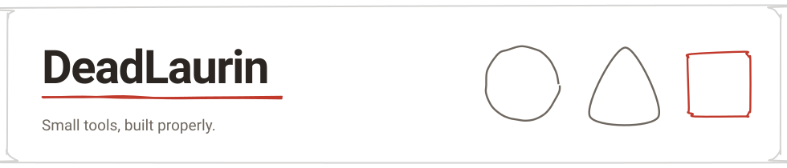
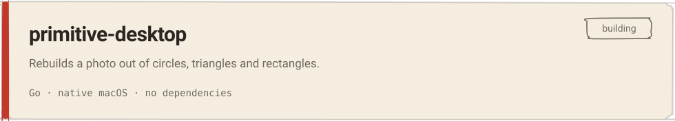

  <picture>
    <source media="(prefers-color-scheme: dark)" srcset="assets/hero-dark.svg">
    
  </picture>

  Shell scripts for media encoding, native macOS apps in Go, and a browser jigsaw 
  puzzle in TypeScript. Some of it lives here; more of it is private for now.

  <picture>
    <source media="(prefers-color-scheme: dark)" srcset="assets/divider-dark.svg">
    
  </picture>

<h3 align="center">Building</h3>

  <a href="https://github.com/DeadLaurin/primitive-desktop">
    <picture>
      <source media="(prefers-color-scheme: dark)" srcset="assets/card-1-dark.svg">
      
    </picture>
  </a>

  <picture>
    <source media="(prefers-color-scheme: dark)" srcset="assets/divider-dark.svg">
    
  </picture>

<h3 align="center">Tools</h3>

  <picture>
    <source media="(prefers-color-scheme: dark)" srcset="assets/chips-languages-dark.svg">
    
  </picture>

  <picture>
    <source media="(prefers-color-scheme: dark)" srcset="assets/chips-platforms-dark.svg">
    
  </picture>

  <picture>
    <source media="(prefers-color-scheme: dark)" srcset="assets/divider-dark.svg">
    
  </picture>

<h3 align="center">By the numbers</h3>

  <picture>
    <source media="(prefers-color-scheme: dark)" srcset="https://github-readme-stats.vercel.app/api?username=DeadLaurin&show_icons=true&include_all_commits=true&hide_border=true&bg_color=00000000&title_color=eae3d6&text_color=9d9488&icon_color=ff8a7a">
    
  </picture>
  <picture>
    <source media="(prefers-color-scheme: dark)" srcset="https://github-readme-stats.vercel.app/api/top-langs/?username=DeadLaurin&layout=compact&hide_border=true&bg_color=00000000&title_color=eae3d6&text_color=9d9488">
    
  </picture>

  <picture>
    <source media="(prefers-color-scheme: dark)" srcset="https://streak-stats.demolab.com/?user=DeadLaurin&hide_border=true&background=00000000&stroke=9d9488&ring=ff8a7a&fire=ff8a7a&currStreakNum=eae3d6&currStreakLabel=9d9488&sideNums=eae3d6&sideLabels=9d9488&dates=6e675f">
    
  </picture>

  <a href="https://github.com/DeadLaurin?tab=repositories">All repositories →</a>

